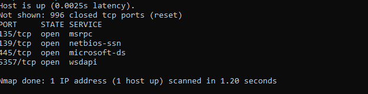
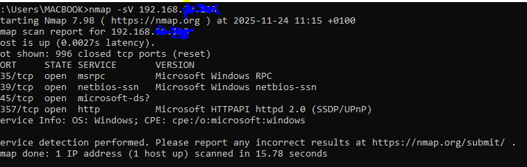
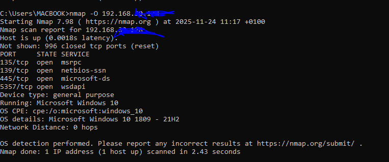

# Network-Testing
## Summary
I am using Nmap to enumerate services ports and operating systems of a device in my lab lan network. Everything performed in this repo was done in a controlled lab environment with authorization.

## Environment Setup
- wifi router
-  nmap (host device)
-  Lab PC (Host)
-  Target PC

## Commands and Ip ranges
- **Host IP**: using Ipconfig i got my ip 192.198.*.*
- **Basic Scan**: nmap 192.198.
- **Service Version Detection**: nmap -sV 192.198.*.*
- **OS Detection**: nmap -O 192.198.*.*

## Observations

### Basic-Scan
From the Basic scan results i discovered 4 open ports as seen in the image below

- From the image above Nmap (Network Mapper) shows the target device is actively connected to the network and responding to probes.
- The Not shown: 996 closed tcp ports (reset) 
Nmap scans a large range of common ports by default (usually the top 1000 most common).
Closed tcp ports (reset): The target device explicitly responded to 996 port probes with a TCP 'RST' (reset) packet, confirming those specific services are not running or are explicitly blocked. 

## Open Ports and Services
- This is the most critical section. "Open" ports indicate that a service is actively listening for connections on the network.

## TCP Port 135
- Port 135/tcp is associated with MSRPC (Microsoft Remote Procedure Call), which serves as the endpoint mapper for RPC services. This port allows clients to bind to a remote computer and enumerate available services or request specific service ports. While it is essential for certain Windows functionalities, having it open can pose security risks, as it may be exploited by attackers to gain unauthorized access to services on the system.

## Security Implications and vulnerability of TCP Port 135
- While TCP Port 135 is essential for Windows RPC services, it is also one of the most frequently targeted network ports due to its association with RPC services and DCOM communication. These protocols are fundamental to Windows-based networks, but their design leaves room for exploitation, making Windows Port 135 a prime attack vector for cybercriminals. One of the biggest risks associated with TCP 135 is its history of being exploited in major cyberattacks. 
- Beyond malware propagation, network Port 135 is often exploited in denial-of-service (DoS) attacks. Attackers can overwhelm TCP 135 with excessive requests and RPC-dependent services to slow down or crash entirely. A targeted attack on Windows Port 135 could disrupt an entire organization’s workflow and leave systems inaccessible across the board. Because the TCP 135 Port is used for facilitating remote connect ports in Windows-based networks, attackers may also exploit it to execute unauthorized commands or escalate privileges within a system. If a hacker gains access through an exposed Windows RPC Port, they can move laterally across the network, install malicious software, or extract sensitive data without the victim’s knowledge.

## How To Secure TCP Port 135
- Due to its extensive reach, securing TCP port 135 requires checking multiple boxes to minimize the chances of DoS attacks, unauthorized access, malware infections, and other security risks. Typically, setting up firewall rules, port restrictions, and updating security patches must be done and observe regularly.
- One of the most effective ways to secure TCP 135 is by using firewall configurations to limit or block access. Windows and third-party firewalls allow administrators to create custom rules that prevent external threats from exploiting Port 135 RPC. If Windows RPC services are not required for specific operations, the best practice is to close network Port 135 entirely to eliminate any potential attack surface.
- For businesses that rely on Windows RPC Port for essential services like Active Directory and Microsoft Exchange Server, it’s recommended to restrict access to internal, trusted networks. To prevent remote attacks and access from untrusted sources, firewalls should be configured to allow TCP 135 traffic only from authorized IP addresses.
- Disable RPC Services When Not Needed
- Since TCP 135 Port is used for remote procedure calls, disabling Windows RPC services can significantly reduce security risks in environments where they are not essential. If a system does not rely on network Port 135, administrators can disable DCOM and RPC services through the Windows Registry or Group Policy settings. This approach ensures that attackers cannot exploit Port 135 vulnerabilities to gain unauthorized access.

## Thoughts on TCP Port 135
- TCP Port 135 is a crucial part of Windows-based networks, but its importance comes with significant security risks. Attackers frequently target Windows Port 135 to exploit RPC vulnerabilities, launch denial-of-service attacks, and gain unauthorized access to systems.

History has shown what happens when network Port 135 is left exposed. Attacks like WannaCry and Blaster Wormspread rapidly and cause major security issues for organizations. That’s why securing Windows RPC Port isn’t optional. Organizations must take proactive measures, from restricting access with firewalls to disabling RPC services when unnecessary and keeping systems patched.

- A strong security posture isn’t just about locking down a single remote connect port; it’s about building a network that’s resilient to threats. Regular updates, monitoring, and controlled access are key to reducing risks and keeping systems protected.
However, before disabling Windows Port 135 RPC, it’s important to assess the impact on business applications and network operations. Some services may require remote connect ports for communication, and disabling RPC without proper planning could disrupt critical workflows
- I have confirmed something about TCP port 135:
Anyone can connect to TCP port 135 then get RPC interfaces list without any permission.

## TCP Port 139
- Port 139/tcp, known as NetBIOS Session Service (netbios-ssn), is a legacy but still active port primarily used for Server Message Block (SMB) file and printer sharing in older Windows environments. It provides connection-oriented communication over TCP/IP (NBT, or NetBIOS over TCP/IP) and is an indicator that the target system supports older networking protocols.
- It facilitates the establishment and maintenance of sessions between two computers to exchange large amounts of data, primarily for shared resources.
- In a Windows network environment, port 139 plays an important role in enabling vital networking services that rely on NetBIOS. Here are some examples
- File and Printer Sharing

One primary use of port 139 is to allow Windows computers on a LAN to share files and printers. When you share a folder or printer in Windows, clients connect to it using NetBIOS over TCP/IP and port 139.
- Windows Authentication

Windows uses NetBIOS for authentication and access control to shared files and printers. When accessing a shared resource, the NetBIOS session service on port 139 transmits credentials and authenticates the user.
- SMB Protocol

The SMB protocol heavily relies on NetBIOS and port 139 for Windows file sharing and print sharing. SMB sessions are established over NetBIOS utilizing TCP port 139.
- Windows Services

Many Windows services, like Server Message Block (SMB), rely on NetBIOS and use the session service on port 139. Thus, port 139 is critical for vital Windows server functions.
- Network Browsing

Windows machines use port 139 for network browsing, i.e., viewing other computers and shared resources on the LAN. The NetBIOS session service resolves names and facilitates browsing.
- Remote Administration

Administrators use port 139 for remote management tools that rely on NetBIOS, such as the Windows ADMIN$ share, Remote Desktop, Windows Remote Management (WinRM), and more.

## Security Implications and vulnerability of TCP Port 139

- Port 139 presents significant security risks, especially if the device is exposed to the public internet without a firewall or proper configuration.
- Vulnerability to Legacy Exploits:

This port is associated with older, less secure versions of the SMB protocol (SMBv1). Historic and devastating attacks, such as the WannaCry ransomware that leveraged the EternalBlue exploit (CVE-2017-0144), targeted vulnerabilities in SMBv1 that were often accessed via this port.
Unauthorized Access and Data Leaks: If shared folders are not protected by strong passwords and stringent permissions, an attacker can gain unauthorized access to sensitive files and data.
- Null Sessions:

Inadequately configured systems can allow "null sessions" (unauthenticated access), where an attacker can connect and enumerate information like usernames, computer names, and shared resource names (CVE-1999-0504). This reconnaissance data is valuable for planning further attacks.
- Credential Theft: 

The older NTLM authentication used by these protocols can be susceptible to Man-in-the-Middle (MitM) attacks where an attacker can capture password hashes for offline cracking or "pass-the-hash" attacks.

## How To Secure TCP Port 139

- Block at the Firewall:

Block all inbound traffic to port 139 from external (internet) sources using your router or the Windows firewall. It should only be accessible within a secure local network.
- Disable SMBv1:

This is a crucial step. Disable the outdated SMBv1 protocol in Windows. Modern systems can use SMBv2 or SMBv3, which operate exclusively over port 445 (bypassing NetBIOS) and include security enhancements like encryption.
- Apply Patches:

Ensure the operating system is fully up-to-date with the latest security patches from Microsoft to protect against any known, unpatched vulnerabilities.
- Use Strong Access Controls:

If file sharing is necessary, use strong, complex passwords and the principle of least privilege, ensuring users only have access to the specific resources they need.

## TCP Port 445
- TCP port 445 stands as a crucial node, facilitating the swift and efficient exchange of resources like files and printer services between computers on the same network. Yet, its significance as a channel for Server Message Block (SMB) communication within Windows operating systems also makes it a vulnerable target for cyber threats.
- Port 445 is a network port used by the SMB protocol that is integral to accessing shared resources on a network. SMB operates at the application layer and allows nodes within a network to communicate, share files, and utilize shared services like printers and access to shared directories. Its role is foundational for intra-network communication and resource sharing, particularly in Windows-operated network environments.

It replaces earlier versions of SMB that operated over ports 137 ,138, and 139 using NetBIOS. Microsoft transitioned to using port 445 for SMB traffic with the release of Windows 2000.

While it’s essential in many enterprise environments, this port has become a major security liability, particularly when exposed to the internet. Attackers routinely scan for open port 445 instances, which can serve as an entry point into systems and facilitate ransomware attacks or lateral movement.

## Security Implications and vulnerability of TCP Port 445
- Despite its utility, TCP 445’s open nature can also be its Achilles’ heel, exposing networks to unauthorized access and malicious exploits. Cybercriminals can leverage vulnerabilities in this port to inject malware, ransomware, or carry out Denial of Service (DoS) attacks. SMB and Port 445 have played major roles in several notorious cyberattacks. Among the most infamous: Like.

WannaCry ransomware:-- This attack exploited the EternalBlue vulnerability in SMBv1 to spread across networks in over 150 countries in 2017. Closing port 445 could have protected systems that weren’t patched.

NotPetya:-- This attack leveraged SMBv1 vulnerabilities as well. In this case, the attack crippled global enterprise infrastructure.

TrickBot and Emotet:-- Each frequently uses SMB to spread laterally once inside networks.

Port 445 should never be open to the public internet. Yet many organizations still expose it, knowingly or not. The risks of external exposure include the following below:
- Automated botnet scans targeting SMB
- Opportunistic ransomware attacks
- Exploitation of zero-day or unpatched SMB flaws
- Remote system compromise with little or no user interaction

Even if a system behind port 445 is patched, its mere availability makes it a target. Disabling or filtering access to port 445 is a baseline cybersecurity best practice.
## How To Secure TCP Port 445
- 1 Patch and update systems:-- Regular software updates are the first line of defense against vulnerabilities. Ensure all systems are patched with the latest security updates, particularly those addressing TCP 445.
- 2 Disable unnecessary services:- If SMB is not required, consider disabling it to close off potential attack vectors. If SMB must remain active, ensure it’s configured to use SMBv2 or SMBv3, as these versions have enhanced security features compared to SMBv1.
- 3 Configure firewalls effectively:- Firewalls should be set to block external traffic on TCP 445. Allowing unrestricted access to this port can leave networks open to intrusion and attacks. Implement geo-IP filters if necessary to reduce attack surfaces.
- 4 Use VPN for remote access: When accessing network resources remotely, utilize VPN services. A VPN provides an encrypted tunnel for secure communication, preventing the exposure of TCP 445 to the external network
- 5 Implement Intrusion Detection Systems (IDS): An IDS can help detect unusual activities that may signify an attempt to exploit TCP 445. By monitoring network traffic for patterns associated with known attacks, IDS solutions provide an additional layer of security.
- 6 Employ network segmentation: Dividing your network into smaller segments can isolate critical systems, making it harder for a cybercriminal to gain widespread access even if they breach a part of the network.
- 7 Conduct regular vulnerability scans: Routine scans can uncover potential exploits in network infrastructure, allowing for preemptive action to secure TCP 445 against known threats.
- 8 Back-up critical data: Regular backups of essential data can mitigate the damage from ransomware attacks that might exploit TCP 445. Ensure backups are stored securely and tested regularly for integrity.
- 9 Establish strong access controls: Implement rigorous authentication and authorization processes for accessing network resources via SMB to ensure only legitimate users have access.

## Thoughts on TCP Port 445
- TCP 445 is a vital component of network communication that, if left unprotected, can become a gateway for cybercriminals. By understanding the port’s role, associated risks, and implementing a multi-layered defense strategy, organizations can fortify their network against potential threats. Proactive risk management, combined with continuous monitoring and prompt response to vulnerabilities, forms the bedrock of secure network communication in today’s cyber landscape.

## TCP Port 5357
- Port 5357 is used by the Web Services for Devices API (WSDAPI), a Microsoft implementation of WS-Discovery, which allows devices on a local network to advertise and discover services such as printers, scanners, and file shares. It’s primarily used in Windows environments, where it facilitates the automatic discovery of devices without needing a central server or manual configuration.

When enabled, WSD uses HTTP over port 5357 (and multicast over 3702/UDP) to allow applications to communicate with services such as WSD-enabled printers or network scanners. It is typically open on Windows clients, printers, and IoT devices, particularly in unmanaged or small networks.

## Security Implications and vulnerability of TCP Port 5357
- An open port 5357 is typically a standard part of Windows network discovery when your network profile is set to "Private" or "Domain". The risks are generally confined to the local network unless misconfigurations expose the port to the public internet.
- Unauthorized access: Since devices advertise their presence openly, attackers on the same network may identify and interact with exposed services if insufficient access controls are in place. Attackers can use this service to gather information about connected devices (hostnames, printer names, metadata) which aids in network reconnaissance.
- Man-in-the-middle attacks: Without encryption, SOAP messages exchanged between devices and hosts can be intercepted and potentially modified.
- Denial of Service (DoS): Malicious actors may flood WSDAPI listeners with probes or malformed requests, overwhelming device or network resources.
- Misconfiguration Risk: If a firewall is improperly configured to allow inbound traffic on this port from the public internet, the attack surface is significantly increased.
- Lateral Movement: Attackers already inside a local network can leverage this port to discover and interact with more devices, facilitating further movement across systems

## How To Secure TCP Port 5357
- Restrict Access to Port 5357

Ensure WSD is only accessible on local subnets and block access from untrusted or external networks.

Disable WSD Where Not Needed

Ensure Proper Firewall Profile: The Windows Firewall, by default, generally allows WSD traffic only on "Private" or "Domain" profiles but blocks it entirely on "Public" profiles. Ensure your network profile is set correctly.

Replace WSD with more manageable protocols like IPP or LPD, which allow better control and authentication.

Monitor WSD Activity

Watch for unexpected traffic on port 5357 or excessive service discovery broadcasts.

Block inbound TCP port 5357 traffic from external sources (the internet) using your router or the Windows Advanced Firewall settings. 

### Service Version
Next I run the following command to detect the Service version. nmap -sV 192.168.30 The image below shows the result of the scan. 

### OS Detection
Next i want to detect the Operating System of the device. I run the following command to detect the Operating system. nmap -O 192.168.

